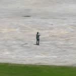

# Human Action Recognition Project

This project is based on the paper:

**LEI WANG, YANGYANG XU, JUN CHENG, HAIYING XIA, JIANQIN YIN, AND JIAJI WU. Human Action Recognition by Learning Spatio-Temporal Features With Deep Neural Networks**

The code is structured using this great Tensoflow template:
https://github.com/Mrgemy95/Tensorflow-Project-Template

Training and testing on UCF-ARG dataset:
http://crcv.ucf.edu/data/UCF-ARG.php

# Prerequisites
opencv, python 3.5, numpy, tensorflow 1.10, slim

# Dataset preparation
The actual videos that were used for training are a modified version of UCF-ARG, and are not provided here. In order to create the dataset, FAST-RCNN was used for human detection, and crops of 150x150 were taken around the detection for 40 consecutive frames (see example .gifs). Create "test_list.txt", "train_list.txt", "val_list.txt" according to the format:

file_name.avi  label/n
Place videos from each label in a folder with the label name. 

# Installation
1. Clone this repository
2. Get the pretrained (on imagenet) mobilenet checkpoint: mobilenet_v2_1.0_224.ckpt from https://github.com/tensorflow/models/tree/master/research/slim.
3. Edit "paths.json" with the correct paths to the train/test/validate lists, mobilenet, and date set videos.
4. Modify "params.json" for your needs.
5. Run python example.py
